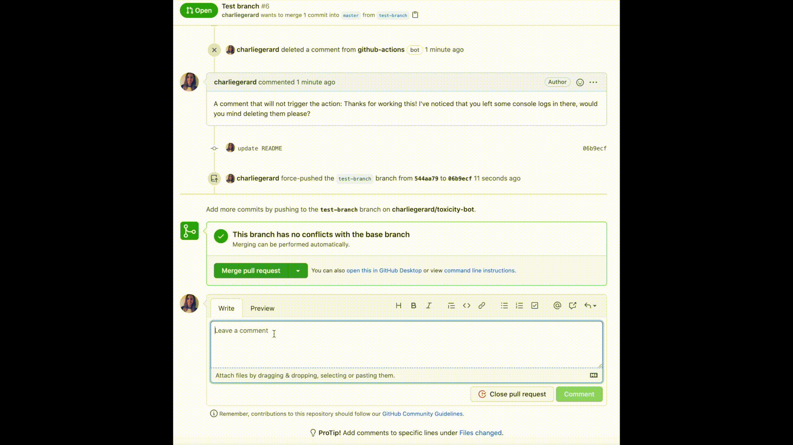

# Safe space - Github action

Github action that uses machine learning to detect potential toxic comments added to PRs and issues so authors can have a chance to edit them and keep repos a safe space.

It uses the [Tensorflow.js toxicity classification model](https://github.com/tensorflow/tfjs-models/tree/master/toxicity).

It currently works when comments are posted on issues and PRs, as well as when pull request reviews are submitted.

## Demo



If you want some details about how it works, feel free to check the [blog post](https://charliegerard.dev/blog/github-action-toxic-comments).

## How to use

_If you do not have any Github actions already set up in your repo, start by creating a .github/workflows folder._

Inside your workflows folder, create a new .yml file, for example `main.yml` and copy the following lines:

```yml
on: [issue_comment, pull_request_review]

jobs:
  toxic_check:
    runs-on: ubuntu-latest
    name: Safe space
    steps:
      - uses: actions/checkout@v2
      - name: Safe space - action step
        uses: charliegerard/safe-space@master
        with:
          GITHUB_TOKEN: ${{ secrets.GITHUB_TOKEN }}
```

`GITHUB_TOKEN` is **required** but two other parameters are optional:

- `message` - a custom message you'd like to display in the automatic comment
- `toxicity_threshold` - a float number between 0 and 1. It will be used when loading the machine learning model. Its default value is 0.9.

```yml
on: [issue_comment, pull_request_review]

jobs:
  toxic_check:
    runs-on: ubuntu-latest
    name: Toxicity check
    steps:
      - uses: actions/checkout@v2
      - name: Safe space - action step
        uses: charliegerard/safe-space@master
        with:
          GITHUB_TOKEN: ${{ secrets.GITHUB_TOKEN }}
          message: "this is my custom message"
          toxicity_threshold: 0.7
```

The action can take up to 40s to run so, if you are testing it out in your repository, keep in mind that the bot will not display right after a toxic comment is posted.
